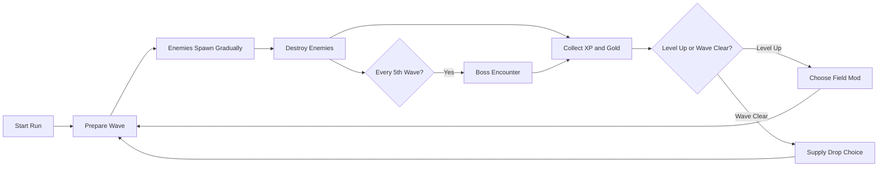
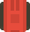
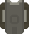
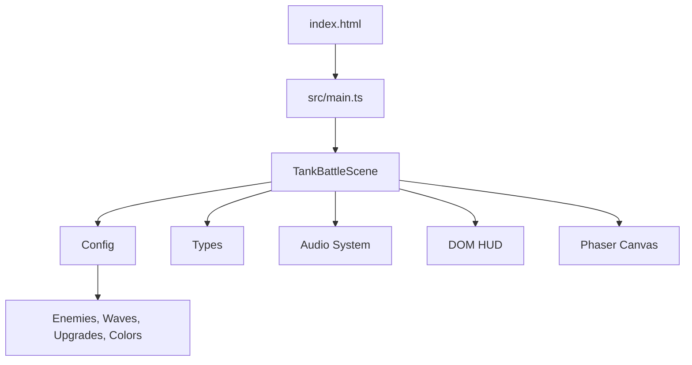

# Tank Game

Modern browser-based tank survival game built with Phaser, TypeScript, and Vite.

<p align="center">
  
  
  
  
</p>

<p align="center">
  
  
  
  
</p>

## Overview

Tank Game is a top-down roguelite arena shooter. The player clears endless enemy waves, collects XP and gold drops, chooses temporary run upgrades, and buys permanent upgrades from an in-game store.

The current version focuses on a clean V1 gameplay loop:

- Fast WASD movement and mouse aiming.
- Space or held left mouse button firing.
- Endless wave progression with a 3-second pre-wave countdown.
- Boss encounters every 5 waves.
- XP drops, gold drops, level-up cards, and permanent gold upgrades.
- Multiple enemy archetypes with different movement and attack behavior.
- Power-ups such as Nuke, Magnet, Freeze, 2x Gold, 2x XP, Repair, and Overdrive.
- Side HUD layout designed to keep the battlefield visible.

## Gameplay Loop



## Controls

| Action | Input |
| --- | --- |
| Move | `WASD` or arrow keys |
| Aim | Mouse |
| Fire | `Space` or hold left mouse button |
| Pause / Resume | `Esc` |
| Restart | `R` |
| Choose upgrade card | `1`, `2`, `3`, or click |
| Open permanent store | Store button in the side HUD |

## Current Features

### Combat

- Square tank bodies with matching collision bounds.
- Player bullets support damage, critical hits, piercing shells, explosive shells, double shot, and triple shot.
- Enemy bullets use accuracy and range rules.
- Boss tanks use stronger health scaling and special attack patterns.
- Mines begin appearing after early waves and reset between waves.

### Enemies

| Enemy | Role | Behavior |
| --- | --- | --- |
| Scout | Basic pressure unit | Moves quickly and strafes near the player. |
| Heavy | Durable shooter | Slower, higher health, heavier damage. |
| Sniper | Long-range threat | Keeps distance and fires faster projectiles. |
| Charger | Close-range pressure | Rushes the player and backs off if too close. |
| Bomber | Suicide unit | Detonates near the player. |
| Shield | Durable blocker | High health and close-mid pressure. |
| Boss | Commander unit | Appears every 5 waves with spread, radial, and burst attacks. |

### Progression

Run-based field mods are selected from cards after level-ups and wave clears:

- Reinforced Armor
- Heavy Shells
- Fast Loader
- Tuned Engine
- High Velocity
- Targeting Optics
- Weak Point Rounds
- Field Training
- Signal Magnet
- Piercing Shells
- Explosive Rounds
- Commander Breaker
- Combat Streak
- Twin Cannons
- Scatter Barrel

Permanent gold upgrades are bought from the store:

- Max HP
- Damage
- Fire Rate
- Crit %
- Crit Damage
- Move Speed
- Pickup Range
- Armor Regen
- Boss Damage

## Visual Assets

The project uses the **Top-down Tanks Redux** asset pack by Kenney.

<p>
  
  
  
  
  
  
</p>

License: Creative Commons Zero, CC0. See [public/assets/kenney-tanks/License.txt](public/assets/kenney-tanks/License.txt).

## Tech Stack

| Layer | Technology |
| --- | --- |
| Game engine | Phaser 4 |
| Language | TypeScript |
| Build tool | Vite |
| Styling | CSS |
| Persistence | Browser localStorage |
| Assets | Kenney CC0 tank sprites |

## Project Structure

```text
tank-game/
├── index.html
├── package.json
├── public/
│   └── assets/
│       └── kenney-tanks/
├── src/
│   ├── main.ts
│   ├── style.css
│   └── game/
│       ├── config.ts
│       ├── types.ts
│       ├── systems/
│       │   └── audio.ts
│       └── scenes/
│           └── TankBattleScene.ts
├── start.bat
└── start.sh
```

## Getting Started

### Requirements

- Node.js 18 or newer
- npm

### Install

```bash
npm install
```

### Run Locally

```bash
npm run dev
```

Vite will print a local URL, usually:

```text
http://localhost:5173/
```

Windows users can also run:

```bash
start.bat
```

macOS/Linux users can run:

```bash
./start.sh
```

## Build

```bash
npm run build
```

The production output is generated in `dist/`.

## Preview Production Build

```bash
npm run preview
```

## Architecture Notes



The game is intentionally small and V1-friendly:

- `src/game/config.ts` owns tunable balance values such as enemy stats, waves, colors, power-up labels, and upgrade options.
- `src/game/types.ts` defines shared gameplay contracts.
- `src/game/scenes/TankBattleScene.ts` contains the main gameplay scene, including movement, combat, wave spawning, upgrades, pickups, mines, HUD sync, and shop logic.
- `src/game/systems/audio.ts` keeps sound generation separate from gameplay state.
- `index.html` contains the DOM-based side HUD and permanent store modal.
- `src/style.css` owns the game shell, HUD, store modal, and responsive layout.

## Persistence

The game stores local progression in the browser:

- Best score
- Permanent gold
- Permanent store upgrade levels

To reset local progression during development, clear the browser's localStorage for the game origin.

## Development Notes

Useful edit points:

| Goal | File |
| --- | --- |
| Tune player, enemies, waves, upgrades | `src/game/config.ts` |
| Add new enemy, power-up, or upgrade type | `src/game/types.ts` |
| Change gameplay behavior | `src/game/scenes/TankBattleScene.ts` |
| Change HUD/store layout | `index.html` |
| Polish UI styling | `src/style.css` |
| Adjust generated audio cues | `src/game/systems/audio.ts` |

## Suggested Roadmap

- Add a proper main menu with settings, audio toggles, and run statistics.
- Add more map layouts with stronger visual identity.
- Add enemy telegraphs for boss attacks and mines.
- Add pickup icons instead of text-first pickup markers.
- Add permanent upgrade balancing and price scaling pass.
- Add mobile/touch controls if mobile support becomes a goal.
- Add save import/export for local progression.
- Add automated smoke tests for boot, pause, restart, and upgrade selection.

## License

Game code: add a project license before publishing.

Third-party assets: Kenney **Top-down Tanks Redux**, CC0. See [public/assets/kenney-tanks/License.txt](public/assets/kenney-tanks/License.txt).
